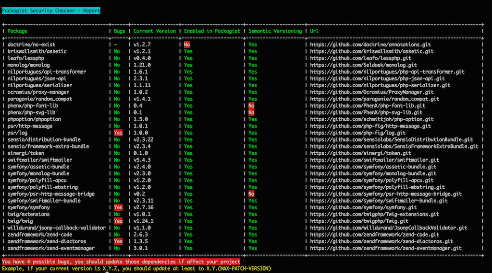
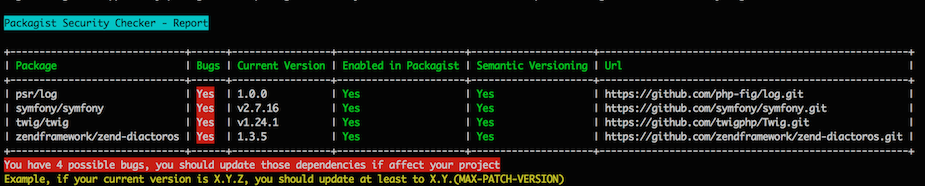
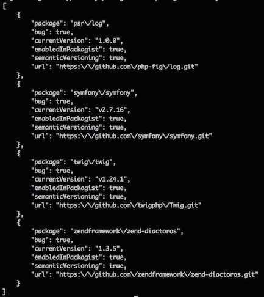

# Packagist Security Checker

## About

Tool to check possible bugs in your dependencies (public and private dependencies). It is based on [semver](http://semver.org) to detect bugs
in your dependencies.

Example:

In your composer.lock you have this package:

```
"name": "twig/twig",
"version": "v1.24.1",
```

Where version follow format: MAJOR.MINOR.PATCH, read more in [semver](http://semver.org), so if exist in packagist that package with the same MAJOR, MINOR and next
patch version mean you have a possible bug in your dependencies and you should update them.


## Why?

### Composer

With composer you can know if your dependencies need to be updated, example:

```
composer outdate
```

This command will show packages you can update and latest versions, but some times is not necessary update them if you do not need
new funcionalities of those packages, but if your dependency there are bug fixes you should update them at least to last PATCH version, and you can get this info from Packagist Security Checker.

### SensioLabs - Security Checker

This is a great tool created by SensioLabs. It checks if your application uses dependencies with known security vulnerabilities.
It uses the SensioLabs Security Check Web service and the Security Advisories Database.

Usually bugs of most popular libraries are reported to Security Advisories Database, but libraries not really popular but they are used by others projects are not reported or maybe their database
are not updated. As well this service works only for public repositories.

###  Packagist Security Checker

Packagist Security Checker use API from packagist and uses semantic versioning to detect possible bugs. It works with popular and no popular
libraries if they are enabled in packagist.

This tool can be used as well in your instance of [packagist](https://github.com/composer/packagist) in your company, so in this case can detect possible bugs in private repositories as well.


## Limitations

- If a package do not follow semantic versioning (example: tags v0.9 instead of v0.9.0) this package will be ignored like possible bugs, the tool can not check it.
- It can happen semantic versioning is not used properly and can show you bad results, anyway you always will can check changelog file of that repository and confirm yourself.


## Usage

See all report

```
./bin/packagist-security-checker sc <path-composer-lock-file>
```

See only bugs

```
./bin/packagist-security-checker sc <path-composer-lock-file> --only-bugs
```

Get report in json format

```
./bin/packagist-security-checker sc <path-composer-lock-file> --only-bugs --format=json
```

Execute tool with your own instance of packagist:

```
./bin/packagist-security-checker sc <path-composer-lock-file> --packagist-url=https://packagist.mycompany.com
```

## Integration

You can easily integrate the checker into your project:

### Add command in your Symfony Console Application

- Using the `PackagistSecurityCheckerCommand` class into your Symfony Console application
```php
use BernardoSecades\Packagist\SecurityChecker\PackagistSecurityChecker;
use BernardoSecades\Packagist\SecurityChecker\Command\PackagistSecurityCheckerCommand;

$app = new Application();
$app->add(new PackagistSecurityCheckerCommand(new PackagistSecurityChecker()));
```

### Use class directly in your own code

- Or using the `PackagistSecurityChecker` class directly in your own code

```php
use BernardoSecades\Packagist\SecurityChecker\PackagistSecurityChecker;

$ch = new PackagistSecurityChecker();
$reportPackages = $ch->check('/path/composer.lock');
```

## Installation

```
composer require bernardosecades/packagist-security-checker --dev
```

### .phar file

You can also use already last built `.phar`.

```bash
$ git clone git@github.com:bernardosecades/packagist-security-checker.git
$ cd packagist-security-checker
$ php build/packagist-security-checker.phar
```

You can copy the `.phar` file as a global script

```bash
$ cp build/packagist-security-checker.phar /usr/local/bin/packagist-security-checker
```

### Compile

You can also compile your own version of the package. (Remember you will need set phar.readonly = Off in your php.ini).

```bash
$ git clone git@github.com:bernardosecades/packagist-security-checker.git
$ cd packagist-security-checker.git
$ composer install
$ php bin/compile
$ sudo chmod +x build/packagist-security-checker.phar
$ build/packagist-security-checker.phar
```

You can copy the `.phar` file as a global script

```bash
$ cp build/packagist-security-checker.phar /usr/local/bin/packagist-security-checker
```

## Screenshots

`./bin/packagist-security-checker sc tests/fixtures/composer.lock`



`./bin/packagist-security-checker sc tests/fixtures/composer.lock --only-bugs`



`./bin/packagist-security-checker sc tests/fixtures/composer.lock --only-bugs --format=json`




